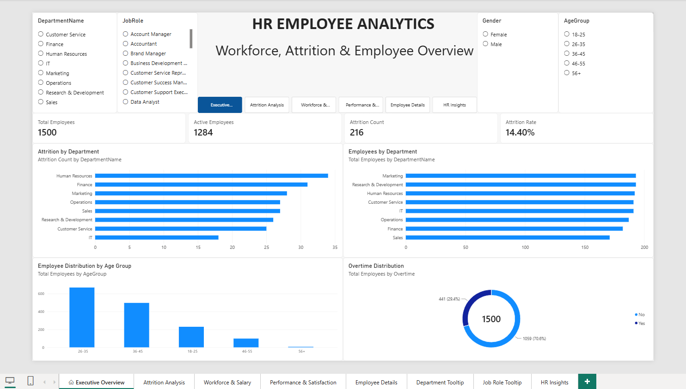
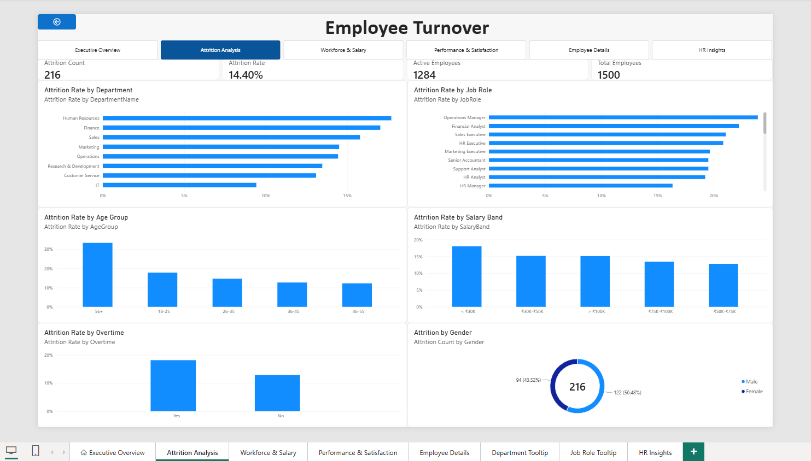
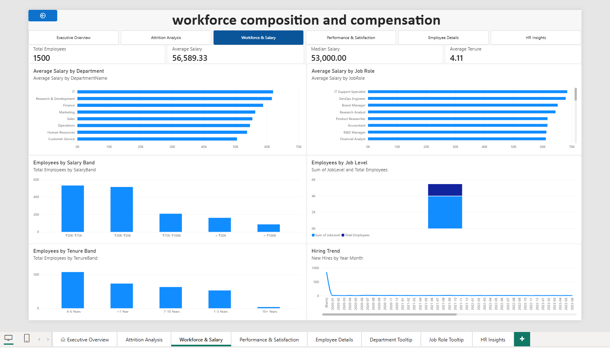
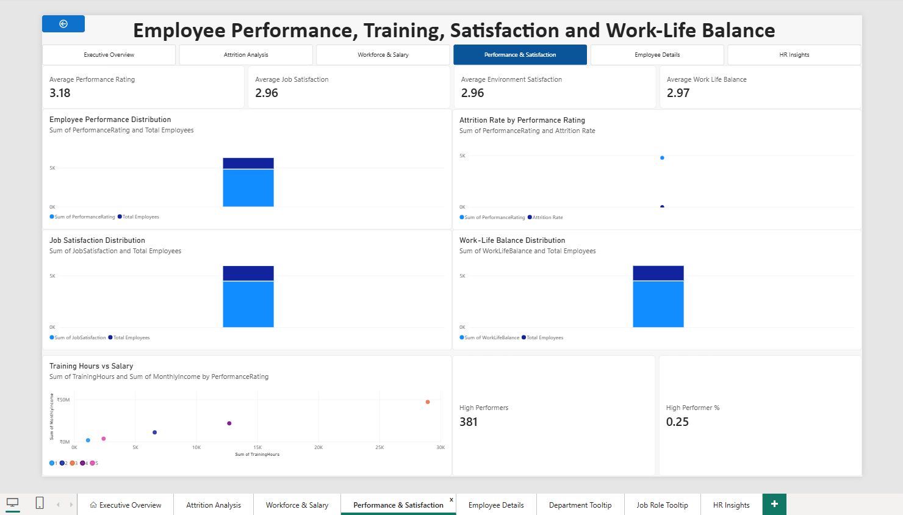
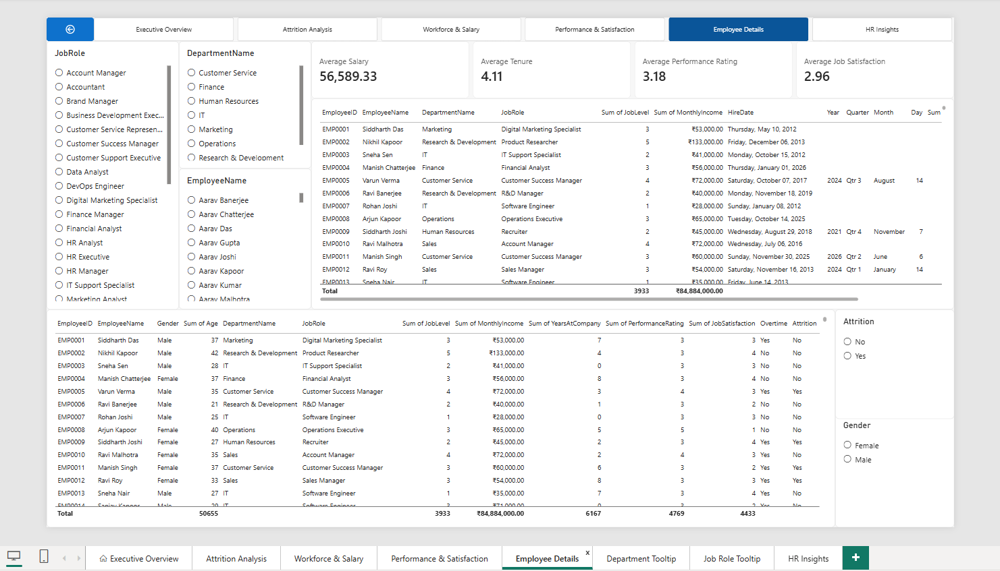
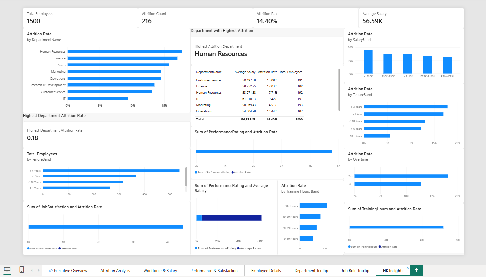

# HR Employee Analytics Dashboard


## 📊 Project Overview

The **HR Employee Analytics Dashboard** is an end-to-end data analytics portfolio project designed to analyze employee demographics, workforce composition, salary, tenure, performance, satisfaction, overtime, business travel, and attrition.

The project demonstrates a complete analytics workflow:

**Python → Excel → MySQL → SQL → Power Query → DAX → Power BI**

The dashboard transforms a 1,500-employee dataset into interactive HR insights that can support workforce analysis and reporting.

> **Author:** Rishab Roy

---

## 🎯 Objectives

- Analyze overall workforce composition.
- Measure employee attrition and attrition rate.
- Analyze salary distribution across departments and job roles.
- Study employee tenure and career progression.
- Compare job, environment, and work-life satisfaction.
- Analyze performance ratings and training hours.
- Identify workforce patterns using interactive Power BI filters.
- Validate analytical results using MySQL SQL queries.

---

## 🛠️ Technology Stack

| Technology | Purpose |
|---|---|
| **Python** | Dataset generation, transformation, validation |
| **Pandas** | Data processing and preparation |
| **Excel** | Data storage, workbook preparation and documentation |
| **MySQL** | Relational database and SQL analysis |
| **SQL** | KPI calculations, aggregations and analytical queries |
| **Power Query** | Data transformation and modeling |
| **Power BI** | Interactive dashboard and visualization |
| **DAX** | Measures and KPI calculations |
| **Git/GitHub** | Version control and portfolio publishing |

---

## 📁 Repository Structure

```text
HR-Employee-Analytics-Dashboard/
│
├── Dataset/
│   ├── HR_Employee_Data.csv
│   ├── HR_Employee_Data.xlsx
│   └── HR_Employee_Analytics.xlsx
│
├── Documentation/
│   ├── Data_Dictionary.xlsx
│   ├── Project_Report.pdf
│   └── SQL_Analysis.md
│
├── PowerBI/
│   └── HR Employee Analytics.pbix
│
├── Python/
│   ├── generate_hr_dataset.py
│   ├── create_excel_workbook.py
│   └── import_excel_to_mysql.py
│
├── SQL/
│   ├── database_setup.sql
│   ├── data_analysis.sql
│   └── views.sql
│
├── Screenshots/
│   ├── executive-overview.png
│   ├── attrition-analysis.png
│   ├── workforce-salary.png
│   ├── performance-satisfaction.png
│   ├── employee-details.png
│   └── hr-insights.png
│
├── README.md
├── LICENSE
└── dashboard_preview.gif
```

---

## 📈 Key Dashboard KPIs

| KPI | Value |
|---|---:|
| Total Employees | **1,500** |
| Active Employees | **1,284** |
| Attrition Count | **216** |
| Attrition Rate | **14.40%** |
| Average Age | **33.77 years** |
| Average Tenure | **4.11 years** |
| Average Monthly Salary | **~56.59K** |

---

## 🖥️ Dashboard Preview

### Animated Dashboard Preview

Place the generated `dashboard_preview.gif` in the repository root:


### Dashboard Pages

#### 1. Executive Overview
High-level workforce KPIs and overall HR performance.



#### 2. Attrition Analysis
Analysis of employee attrition by department, demographics, overtime, job role and other workforce dimensions.



#### 3. Workforce & Salary
Workforce distribution, salary patterns and job-level analysis.



#### 4. Performance & Satisfaction
Performance ratings, training hours, job satisfaction, environment satisfaction and work-life balance.



#### 5. Employee Details
Detailed employee-level analytical view with interactive filtering.



#### 6. HR Insights
Consolidated HR insights and analytical observations.



---

## 🗄️ Database & SQL Analysis

The MySQL database uses a structured relational design with:

- `employees`
- `departments`
- `job_roles`
- `employees_staging`

The SQL layer includes analysis for:

- Workforce overview
- Attrition
- Department analysis
- Job-role analysis
- Salary analysis
- Age groups
- Tenure
- Overtime
- Performance
- Satisfaction
- Training
- Business travel
- Education
- Job level
- Career progression

Reusable analytical views are also included in:

```text
SQL/views.sql
```

---

## 🐍 Python Workflow

Python is used to prepare and validate the analytical dataset.

### Main scripts

**`generate_hr_dataset.py`**
- Generates the employee dataset.
- Creates realistic HR attributes.
- Produces 1,500 employee records.

**`create_excel_workbook.py`**
- Creates the Excel workbook.
- Organizes the dataset and supporting sheets.

**`import_excel_to_mysql.py`**
- Reads the Excel data.
- Loads the data into MySQL.
- Validates the record count.

---

## 📊 Power BI

The Power BI report contains six analytical pages:

1. Executive Overview
2. Attrition Analysis
3. Workforce & Salary
4. Performance & Satisfaction
5. Employee Details
6. HR Insights

Interactive features include:

- Department filtering
- Job role filtering
- Gender filtering
- Age filtering
- Attrition analysis
- KPI cards
- Charts and tables
- Employee-level detail analysis

---

## 🧮 Example DAX Measures

```DAX
Total Employees =
DISTINCTCOUNT(Employees[EmployeeID])
```

```DAX
Attrition Count =
CALCULATE(
    [Total Employees],
    Employees[Attrition] = "Yes"
)
```

```DAX
Attrition Rate =
DIVIDE(
    [Attrition Count],
    [Total Employees],
    0
)
```

---

## 🔍 Data Validation

The project includes validation across the pipeline:

```text
Excel Records → 1,500
MySQL Records → 1,500
```

The SQL analysis and Power BI KPIs were cross-checked to maintain consistency between the database and dashboard.

---

## 📚 Documentation

- [Data Dictionary](Documentation/Data_Dictionary.xlsx)
- [Project Report](Documentation/Project_Report.pdf)
- [SQL Analysis](Documentation/SQL_Analysis.md)

---

## 🚀 How to Use

### 1. Clone the repository

```bash
git clone https://github.com/rishab612/HR-Employee-Analytics-Dashboard.git
cd HR-Employee-Analytics-Dashboard
```

### 2. Generate or inspect the dataset

Open the scripts inside:

```text
Python/
```

### 3. Set up MySQL

Open:

```text
SQL/database_setup.sql
```

Create the `HR_Analytics` database and required tables.

### 4. Load the data

Run:

```text
Python/import_excel_to_mysql.py
```

Update the local MySQL connection settings in the script as required. Never commit passwords or credentials.

### 5. Run SQL analysis

Use:

```text
SQL/data_analysis.sql
SQL/views.sql
```

### 6. Open Power BI

Open:

```text
PowerBI/HR Employee Analytics.pbix
```

Configure the MySQL connection if required and refresh the model.

---

## 💡 Skills Demonstrated

- Data Cleaning
- Data Preparation
- Exploratory Data Analysis
- Excel
- Python
- Pandas
- SQL
- MySQL
- Database Design
- Data Validation
- Power Query
- DAX
- Power BI
- Dashboard Design
- KPI Development
- Business Intelligence
- HR Analytics
- Data Visualization
- Git/GitHub

---

## 📌 Portfolio Highlights

This project demonstrates an end-to-end analytics workflow rather than only a dashboard:

```text
Raw Data
   ↓
Python Data Preparation
   ↓
Excel Validation
   ↓
MySQL Database
   ↓
SQL Analysis
   ↓
Power Query Transformation
   ↓
DAX Measures
   ↓
Power BI Dashboard
   ↓
Business Insights
```

---

## 👤 Author

### Rishab Roy

Computer Engineering student and aspiring Data Analyst with hands-on project experience in:

**Python • SQL • MySQL • Excel • Power BI • DAX • Data Visualization**

---

## 📄 License

This project is available under the MIT License. See [LICENSE](LICENSE) for details.
